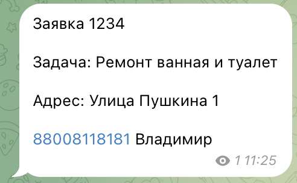
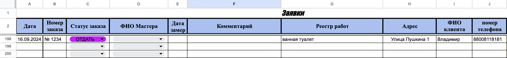

## Описание проекта

Этот бот создан для автоматизации обработки заявок на ремонт из мессенджера Телеграм. Бот автоматически парсит сообщения из закрытого канала, в котором менеджеры оставляют заявки на ремонт, и заполняет данные в Google Таблицы. Это решение помогает сократить время на ручную работу, избежать ошибок при копировании данных и улучшить эффективность обработки заявок.

## Функциональные возможности

- Автоматическое извлечение данных из сообщений в Телеграме.
- Разбор и выделение ключевых данных (номер заявки, описание работ, адрес, контактная информация).
- Автоматическое заполнение данных в Google Таблицы по заранее заданным столбцам.
- Настраиваемая интеграция с Google Sheets API.

## Проблема, которую решает проект

До внедрения автоматизации менеджеры тратили значительное количество времени на ручной перенос информации из мессенджера в гугл таблицы. Этот процесс был неэффективным, трудозатратным и подверженным ошибкам при копировании данных. В результате увеличивалось время на обработку заявок, снижалась производительность и возникали риски человеческих ошибок, что могло негативно сказываться на качестве обслуживания клиентов.

## Требования

Для корректной работы программы необходимы следующие библиотеки и пакеты:

#### Библиотеки Python:

- `configparser` – для работы с конфигурационными файлами.
- `json` – для работы с JSON-файлами и форматированием данных.
- `httplib2` – для работы с HTTP-запросами.
- `googleapiclient.discovery` – для взаимодействия с API Google (в данном случае с Google Sheets API).
- `oauth2client.service_account` – для авторизации через сервисные аккаунты Google.
- `telethon` – для работы с API Telegram и отправки/получения сообщений.
- `datetime` – для работы с датой и временем.

#### Зависимости для установки через pip:

```bash
pip install httplib2 google-api-python-client oauth2client telethon
```

- Python 3.7+
- Доступ к Телеграм-каналу, из которого бот будет парсить заявки
- Доступ к сервисному аккаунту Google для взаимодействия с Google Sheets API.
- Доступ к Telegram API (нужны API ID и Hash, которые можно получить через my.telegram.org).
- Файл конфигурации с ключами и настройками (например, credentials.json для Google API).

## Использование

- После настройки бот будет автоматически отслеживать новые сообщения в канале и переносить соответствующие данные в Google Таблицу.
- Каждый новый заказ будет добавлен в таблицу в виде новой строки, с разбивкой по столбцам.

## Пример работы

Пример заявки из Телеграма:



Эта же заявка, перенесенная в таблицу:



Статус заказа автоматические выставился "ОТДАТЬ". Столбцы "ФИО Мастера", "Дата замера", "Комментарий" заполняются менеджером при дальнейшей обработке.
